<picture><source media="(prefers-color-scheme: dark)" srcset="assets/dark/header.svg"/></picture>

<div align="center">
<a href="https://kpriyam.me"><picture><source media="(prefers-color-scheme: dark)" srcset="https://img.shields.io/badge/PORTFOLIO-0d1117?style=flat-square&logo=vercel&logoColor=ffffff"/></picture></a>
<a href="https://www.linkedin.com/in/kumar-priyam-71bbb82a7/"><picture><source media="(prefers-color-scheme: dark)" srcset="https://img.shields.io/badge/LINKEDIN-0d1117?style=flat-square&logo=data:image/svg%2Bxml;base64,PHN2ZyB4bWxucz0iaHR0cDovL3d3dy53My5vcmcvMjAwMC9zdmciIHZpZXdCb3g9IjAgMCAyNCAyNCI%2BPHBhdGggZmlsbD0iI2ZmZmZmZiIgZD0iTTIwLjQ0NyAyMC40NTJoLTMuNTU0di01LjU2OWMwLTEuMzI4LS4wMjctMy4wMzctMS44NTItMy4wMzctMS44NTMgMC0yLjEzNiAxLjQ0NS0yLjEzNiAyLjkzOXY1LjY2N0g5LjM1MVY5aDMuNDE0djEuNTYxaC4wNDZjLjQ3Ny0uOSAxLjYzNy0xLjg1IDMuMzctMS44NSAzLjYwMSAwIDQuMjY3IDIuMzcgNC4yNjcgNS40NTV2Ni4yODZ6TTUuMzM3IDcuNDMzYy0xLjE0NCAwLTIuMDYzLS45MjYtMi4wNjMtMi4wNjUgMC0xLjEzOC45Mi0yLjA2MyAyLjA2My0yLjA2MyAxLjE0IDAgMi4wNjQuOTI1IDIuMDY0IDIuMDYzIDAgMS4xMzktLjkyNSAyLjA2NS0yLjA2NCAyLjA2NXptMS43ODIgMTMuMDE5SDMuNTU1VjloMy41NjR2MTEuNDUyek0yMi4yMjUgMEgxLjc3MUMuNzkyIDAgMCAuNzc0IDAgMS43Mjl2MjAuNTQyQzAgMjMuMjI3Ljc5MiAyNCAxLjc3MSAyNGgyMC40NTFDMjMuMiAyNCAyNCAyMy4yMjcgMjQgMjIuMjcxVjEuNzI5QzI0IC43NzQgMjMuMiAwIDIyLjIyMiAwaC4wMDN6Ii8%2BPC9zdmc%2B"/></picture></a>
<a href="mailto:kpriyam2005p@gmail.com"><picture><source media="(prefers-color-scheme: dark)" srcset="https://img.shields.io/badge/EMAIL-0d1117?style=flat-square&logo=gmail&logoColor=ffffff"/></picture></a>
<a href="https://drive.google.com/file/d/1lPMTdrULT4iWPU5typRmVDVlBtF81wHf/view"><picture><source media="(prefers-color-scheme: dark)" srcset="https://img.shields.io/badge/R%C3%89SUM%C3%89%20%C2%B7%20AI-0d1117?style=flat-square&logo=readdotcv&logoColor=ffffff"/></picture></a>
<a href="https://drive.google.com/file/d/1sDOkbyz0YaCgN3EzVKoCykDRa7ZAyBo9/view"><picture><source media="(prefers-color-scheme: dark)" srcset="https://img.shields.io/badge/R%C3%89SUM%C3%89%20%C2%B7%20SDE-0d1117?style=flat-square&logo=readdotcv&logoColor=ffffff"/></picture></a>
</div>

<br>

<picture><source media="(prefers-color-scheme: dark)" srcset="assets/dark/s01.svg"/></picture>

Final-year CSE at **NIT Delhi**, working both halves of one job: full-stack products end to end
(**React / Next.js** in front, **Node / Express** and **FastAPI** behind) and the AI systems that live
inside them: **pgvector** search, RL-trained retrieval, agents that recover from their own failures.

What I care about sits underneath both: per-tenant isolation, idempotent ingestion, exactly-once
serving under concurrency. Most of what I ship gets deployed, then broken by real usage. That part is the point.

```
role         ai engineer · sde — both halves, equally
full-stack   mern · next.js · fastapi — built, deployed, maintained
ai           rag pipelines · vector search · agent orchestration
research     multi-agent rl for rag retrieval — nit delhi capstone
shipping     jobmatch.kpriyam.me · clinicq
open to      sde & ai engineering roles, 2027
```

<br>

<picture><source media="(prefers-color-scheme: dark)" srcset="assets/dark/s02.svg"/></picture>

<picture><source media="(prefers-color-scheme: dark)" srcset="assets/dark/stack.svg"/></picture>

<br>

<picture><source media="(prefers-color-scheme: dark)" srcset="assets/dark/s03.svg"/></picture>

<p align="center">
<a href="https://jobmatch.kpriyam.me"><picture><source media="(prefers-color-scheme: dark)" srcset="assets/dark/p-jobmatch.svg"/></picture></a>
<a href="https://kpriyam.me/research"><picture><source media="(prefers-color-scheme: dark)" srcset="assets/dark/p-marl-maps.svg"/></picture></a>
<a href="https://github.com/KumarPriyam123/Clinic-Automation"><picture><source media="(prefers-color-scheme: dark)" srcset="assets/dark/p-clinicq.svg"/></picture></a>
<a href="https://github.com/KumarPriyam123/Multi-Tenant-Agentic-Data-Pipeline"><picture><source media="(prefers-color-scheme: dark)" srcset="assets/dark/p-data-pipeline.svg"/></picture></a>
<a href="https://github.com/KumarPriyam123/Interview-Platforms_Users"><picture><source media="(prefers-color-scheme: dark)" srcset="assets/dark/p-interview-platform.svg"/></picture></a>
<a href="https://github.com/KumarPriyam123/MemoryLane"><picture><source media="(prefers-color-scheme: dark)" srcset="assets/dark/p-memorylane.svg"/></picture></a>
</p>

<br>

<picture><source media="(prefers-color-scheme: dark)" srcset="assets/dark/s04.svg"/></picture>

**MERN Stack Development Intern** — Vinidra Infotech Pvt Ltd
<br><sub>May – Jul 2026 · client-facing school learning-management system</sub>

Shipped into an existing team codebase, not a greenfield repo:

- **REST APIs** in Node, Express and MongoDB for the attendance module — Mongoose schemas and role-scoped queries across student, teacher and admin
- **5 React screens**, including a bulk attendance-marking flow with optimistic UI and complete loading, empty and error states
- **25+ defects** resolved across client feedback cycles, shipping **3 iterations** through Git feature branches and peer review

**What production taught me that a tutorial could not:**

- **Exactly-once under concurrency** — transactional row locks, pinned by tests that fire two simultaneous calls at a real Postgres
- **Idempotency everywhere** — `ON CONFLICT DO NOTHING` on a SHA-256 URL hash; webhook replays deduped by message ID
- **164 tests, 0 skipped** — the suite once reported green while silently skipping its 16 concurrency tests, which is worse than no suite

<br>

<picture><source media="(prefers-color-scheme: dark)" srcset="assets/dark/s05.svg"/></picture>

**MARL-MAPS** — *Multi-Agent Reinforcement-Learned, Memory-Augmented, Process-Supervised RAG*
<br><sub>NIT Delhi capstone · three-person team · ongoing</sub>

Standard RAG retrieves on a fixed schedule and pays for it in latency, tokens and hallucinated
steps. MARL-MAPS treats routing as a **Dec-POMDP** and trains the agents to negotiate:

- **Learned routing policy** instead of pass/fail retrieval gates — **91%** of redundant searches eliminated
- **Role-scoped LoRA adapters** (Query / Judge / Answer) over one frozen 7B base — **60%** less VRAM than three models
- **HiPRAG process rewards** penalise hallucinated reasoning steps, not just wrong answers — **+6%** multi-hop F1

Evaluated on HotpotQA over a 9,769-passage FAISS index, served through vLLM on a single T4.

<br>

<picture><source media="(prefers-color-scheme: dark)" srcset="assets/dark/s06.svg"/></picture>

<div align="center">
<picture><source media="(prefers-color-scheme: dark)" srcset="assets/dark/stats.svg"/></picture>
<br>
<br>
<picture><source media="(prefers-color-scheme: dark)" srcset="assets/dark/contrib.svg"/></picture>
</div>

<br>

<picture><source media="(prefers-color-scheme: dark)" srcset="assets/dark/s07.svg"/></picture>

<div align="center">
<a href="https://kpriyam.me"><picture><source media="(prefers-color-scheme: dark)" srcset="https://img.shields.io/badge/PORTFOLIO-0d1117?style=flat-square&logo=vercel&logoColor=ffffff"/></picture></a>
<a href="https://www.linkedin.com/in/kumar-priyam-71bbb82a7/"><picture><source media="(prefers-color-scheme: dark)" srcset="https://img.shields.io/badge/LINKEDIN-0d1117?style=flat-square&logo=data:image/svg%2Bxml;base64,PHN2ZyB4bWxucz0iaHR0cDovL3d3dy53My5vcmcvMjAwMC9zdmciIHZpZXdCb3g9IjAgMCAyNCAyNCI%2BPHBhdGggZmlsbD0iI2ZmZmZmZiIgZD0iTTIwLjQ0NyAyMC40NTJoLTMuNTU0di01LjU2OWMwLTEuMzI4LS4wMjctMy4wMzctMS44NTItMy4wMzctMS44NTMgMC0yLjEzNiAxLjQ0NS0yLjEzNiAyLjkzOXY1LjY2N0g5LjM1MVY5aDMuNDE0djEuNTYxaC4wNDZjLjQ3Ny0uOSAxLjYzNy0xLjg1IDMuMzctMS44NSAzLjYwMSAwIDQuMjY3IDIuMzcgNC4yNjcgNS40NTV2Ni4yODZ6TTUuMzM3IDcuNDMzYy0xLjE0NCAwLTIuMDYzLS45MjYtMi4wNjMtMi4wNjUgMC0xLjEzOC45Mi0yLjA2MyAyLjA2My0yLjA2MyAxLjE0IDAgMi4wNjQuOTI1IDIuMDY0IDIuMDYzIDAgMS4xMzktLjkyNSAyLjA2NS0yLjA2NCAyLjA2NXptMS43ODIgMTMuMDE5SDMuNTU1VjloMy41NjR2MTEuNDUyek0yMi4yMjUgMEgxLjc3MUMuNzkyIDAgMCAuNzc0IDAgMS43Mjl2MjAuNTQyQzAgMjMuMjI3Ljc5MiAyNCAxLjc3MSAyNGgyMC40NTFDMjMuMiAyNCAyNCAyMy4yMjcgMjQgMjIuMjcxVjEuNzI5QzI0IC43NzQgMjMuMiAwIDIyLjIyMiAwaC4wMDN6Ii8%2BPC9zdmc%2B"/></picture></a>
<a href="mailto:kpriyam2005p@gmail.com"><picture><source media="(prefers-color-scheme: dark)" srcset="https://img.shields.io/badge/EMAIL-0d1117?style=flat-square&logo=gmail&logoColor=ffffff"/></picture></a>
<br>
<br>
<sub><b>résumé</b> &nbsp;·&nbsp; <a href="https://drive.google.com/file/d/1lPMTdrULT4iWPU5typRmVDVlBtF81wHf/view">ai engineer</a> &nbsp;·&nbsp; <a href="https://drive.google.com/file/d/1sDOkbyz0YaCgN3EzVKoCykDRa7ZAyBo9/view">sde</a></sub>
<br>
<br>
<sub><code>status: building</code></sub>
</div>
